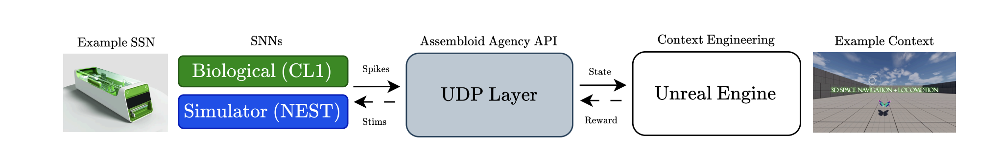

# UE-CL1-API: Unreal Engine API for Brains-on-Chips (CL-1)

A closed-loop UDP interface between Cortical Labs' CL1 biocomputer and Unreal Engine — receive living-neuron spikes as gameplay events, send 'assembloid agency(AA)' electrical stimulation back as feedback.

This repo contains a UE plugin that builds a UDP bridge between **Unreal Engine** and a **CL1**, implementing the closed loop from [*Assembloid Agency*](https://openreview.net/forum?id=BroaBkQAGa)
(Leung & Loewith, NeurIPS 2025 Creative AI Track) on top of the official CL1
spike firehose and the stimulation design outlined in §6 of [*CL API*](https://arxiv.org/abs/2602.11632) (Cortical Labs, 2026).

## Closed-loop API design:



```
   CL1 ──(spike firehose, port 12345)──▶  Unreal Engine
   CL1 ◀──(stimulation/ AA control, port 12346)──   Unreal Engine
```

| File | Runs on | Role |
|------|---------|------|
| `bridge.py` | CL1 / SDK host (or `--selftest` anywhere) | (1) runs `neurons.loop`, streams spikes
|||(2) `apply_command` applies AA control packets|
| `Plugins/UeCl1Api` | your Unreal project | (1)receives and parses spikes and channels via UDP
|||(2) exposes the Assembloid Agency API to C++/Blueprint
|||(3) `sendstimulus` packs stimulus and sends to bridge.py |
| `PROTOCOL.md` | — | wire spec (yours) |
| `PLUGINNOTES.md` | — | how PROTOCOL.md maps to §6 + what changed |

## Data types 

- Spike **timestamp**: `uint64` LE, a **frame index** (40 µs/frame). Seconds =
  frame / 25000. *Not* milliseconds.
- Spike **channel**: `uint8`.
- HDF5 raw samples: `int64` `T×C` + `uV_per_sample_unit`. Live `Spike.samples`:
  float **µV**. The firehose carries no voltage.

## Wire protocol

Spike packet (substrate→UE) is byte-compatible with the official receiver:
`<Q timestamp>` + one `uint8` per channel. Two modes: `per_tick` (default) and
`per_spike` (preserves each spike's own timestamp).

Control packet (UE→substrate) is the Assembloid `'AA'` header `'<2sBBBBHfHH'`
(16 bytes) + channel list. Implemented message types:

- `1 STIM` — biphasic stim / burst. `flags` bit0 charge-balanced (default),
  bit1 interrupt-then-stim.
- `2 INTERRUPT` — clean stop on the listed channels.
- `4 RECORD` — start/stop CL1-side HDF5 recording (`flags` bit0 = start).

See `PLUGINNOTES.md` for the §6 mapping and the v2/v3 rationale.

## Assembloid API (C++ & Blueprint)

```cpp
UCl1BridgeSubsystem* CL1 = GetGameInstance()->GetSubsystem<UCl1BridgeSubsystem>();
CL1->StartReceiver(12345);                              // spike firehose in
CL1->ConfigureControlTarget(TEXT("192.168.1.51"), 12346); // control out
CL1->OnSpike.AddDynamic(this, &AMyPawn::HandleSpike);

// Stimulation: channels, FreqHz, PulseWidthUs, AmplitudeUa, DurationMs
CL1->SendStimulus({20,42}, 100.f, 200, 2.0f, 50.f, /*bInterruptFirst*/true);

// Reinforcement (DishBrain-style; reward == stimulation)
CL1->SendRewardSignal(/*bPositive*/true, {18,19});

// Spike-to-axis mapping for 3D navigation (Assembloid §3.4)
float Fwd = CL1->GetSpikeRateHz(/*Channel*/12, /*WindowSeconds*/0.25f);

// Recording: authoritative HDF5 on the CL1 (§6.4), optional UE-side CSV
CL1->RecordSessionData(true, /*bAlsoLogInUE*/true);
// ... later ...
CL1->RecordSessionData(false);
CL1->ExportToCSV(FPaths::ProjectSavedDir() / TEXT("spikes.csv"));
```

`SendStimulus` converts duration→pulses: `NumPulses = max(1, round(ms/1000 *
FreqHz))`, then the bridge builds the cathodic-first
`StimDesign(pw,-amp,pw,+amp)` (+ `BurstDesign` for bursts) per §6.1.

## Running

```bash
# 1. Validate the whole pipe with synthetic spikes (no SDK/hardware):
python3 bridge.py --selftest --ue-host 127.0.0.1 --ue-port 12345

# 2. Against CL1 / simulator, bidirectional, with a safety envelope:
python3 bridge.py --ue-host 192.168.1.50 --ue-port 12345 \
                  --control-listen-port 12346 \
                  --max-amp 10 --max-channel 63 --rate 1000
```

The safety envelope (Assembloid §5) rejects-and-drops out-of-range commands
(amplitude, pulse width, pulse count, frequency, channel) — it never silently
alters them. Defaults are conservative; set them to your IRB/lab protocol. Note
the channel ceiling: `PROTOCOL.md` uses 0–59, but the CL1 reference is 64
channels (0–63) — use `--max-channel` to match your MEA.

## Backend-agnostic (Assembloid §3.1)

UE only sees UDP, so the same plugin drives a CL1 (via `bridge.py`) or a NEST /
SNN / EEG stand-in that speaks the same firehose + AA convention — identical
state/reward mappings across substrates, per the paper's parallel-configuration
design.

## Files

```
ue-cl1-api/
├── bridge.py
├── PROTOCOL.md
├── CROSSCHECK.md
├── README.md
└── Plugins/UeCl1Api/
    ├── UeCl1Api.uplugin
    └── Source/UeCl1Api/
        ├── UeCl1Api.Build.cs
        ├── Private/UeCl1Api.cpp
        ├── Private/Cl1BridgeSubsystem.cpp
        ├── Public/Cl1BridgeSubsystem.h
        └── Public/Cl1SpikeTypes.h
```
