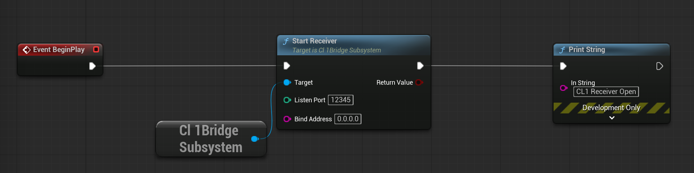
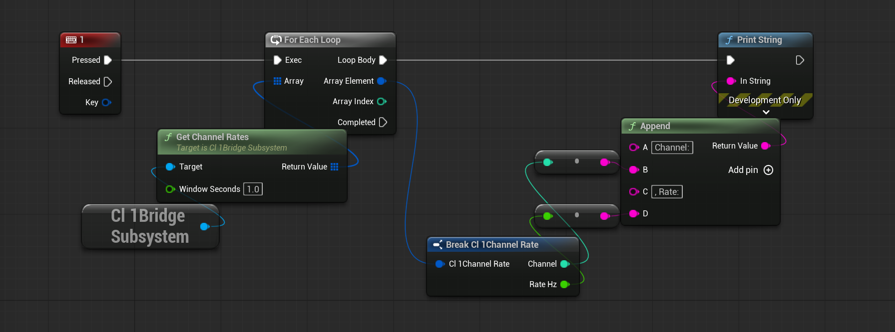
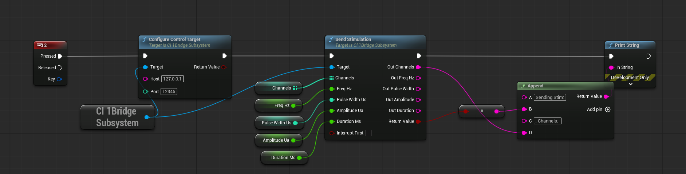
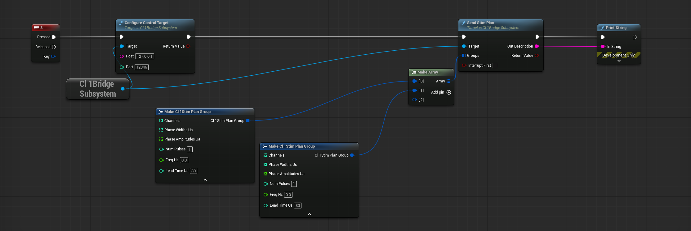

# UE-CL1-API: Unreal Engine API for Brains-on-Chips (CL-1)

A closed-loop UDP interface between Cortical Labs' CL1 biocomputer and Unreal Engine — receive living-neuron spikes as gameplay events, send 'assembloid agency(AA)' electrical stimulation back as feedback.

This repo contains a UE plugin that builds a UDP bridge between **Unreal Engine** and a **CL1**, implementing the closed loop from [*Assembloid Agency*](https://openreview.net/forum?id=BroaBkQAGa)
(Leung & Loewith, NeurIPS 2025 Creative AI Track) on top of the official CL1
spike firehose and the stimulation design outlined in §6 of [*CL API*](https://arxiv.org/abs/2602.11632) (Cortical Labs, 2026).

## Closed-loop API design:


```
   CL1 ──(spike firehose, port 12345)──▶  Unreal Engine
   CL1 ◀──(stimulation/ AA control, port 12346)──   Unreal Engine
```

| File | Runs on | Role |
|------|---------|------|
| `bridge.py` | CL1 / SDK host (or `--selftest` anywhere) | (1) runs `neurons.loop`, streams spikes
|||(2) `apply_command` applies AA control packets|
| `Plugins/UeCl1Api` | your Unreal project | (1) receives and parses spikes and channels via UDP
|||(2) exposes the Assembloid Agency API to C++/Blueprint
|||(3) `sendstimulation` and `sendstimplan` pack stimulation data and sends to bridge.py |

## Data types 

- Spike **timestamp**: `uint64` LE, a **frame index** (40 µs/frame). Seconds =
  frame / 25000. *Not* milliseconds.
- Spike **channel**: `uint8`.
- HDF5 raw samples: `int64` `T×C` + `uV_per_sample_unit`. Live `Spike.samples`:
  float **µV**. The firehose carries no voltage.

## Wire protocol

Spike packet (substrate→UE) is byte-compatible with the official receiver:
`<Q timestamp>` + one `uint8` per channel. The bridge supports `per_tick`
(default, groups channels by loop tick) and `per_spike` (preserves each spike's
own timestamp).

Control packet (UE→substrate) uses the Assembloid `AA` control header
`'<2sBBBBHfHH'` (16 bytes) + channel list. Current version is `2` and the
header fields are: magic, version, msg_type, flags, num_channels,
`pulse_width_us`, `amplitude_uA`, `num_pulses`, `freq_hz`, then channels.

Implemented message types:

- `1 STIM` — biphasic stim / burst. `flags` bit0 = charge-balanced biphasic
  (default), bit1 = interrupt-then-stim.
- `2 INTERRUPT` — clean stop on the listed channels.
- `4 RECORD` — start/stop CL1-side HDF5 recording (`flags` bit0 = start).
- `5 STIMPLAN` — multi-group atomic stimulation plan (supported by the UE plugin
  and bridge).


## Assembloid API (C++ & Blueprint)
### Functionality
This plugin exposes a UE `UCl1BridgeSubsystem` that handles the CL1 ↔ Unreal UDP
bridge and the Assembloid Agency API surface.

- Connection
  - `StartReceiver(port, bindAddress)` starts the UDP spike listener for CL1
    spike packets.
  - `StopReceiver()` stops the listener and frees the socket.
  - `ConfigureControlTarget(host, port)` sets the bridge.py / CL1 control target
    for outbound stimulation and recording commands.

- Stimulation
  - `SendStimulation(channels, FreqHz, PulseWidthUs, AmplitudeUa, DurationMs,
    bInterruptFirst)` sends a biphasic stimulation command to the bridge.
  - `SendStimPlan(groups, bInterruptFirst)` sends an atomic multi-group stim plan
    for coordinated burst patterns across channels.
  - `SendRewardSignal(bPositive, RewardChannels, FreqHz, PulseWidthUs,
    AmplitudeUa, DurationMs)` is a reward-style wrapper: positive sends a burst,
    negative acts like an interrupt.
  - `InterruptStim(channels)` cleanly stops ongoing stimulation on selected
    channels.

- Recording
  - `RecordSessionData(bStart, bAlsoLogInUE)` toggles CL1-side HDF5 recording
    over the bridge using the RECORD command.
  - `ExportToCSV(FilePath)` writes the UE-side spike log to CSV for quick
    debugging and offline analysis.

- Readback and visualization
  - `GetSpikeResponse(channel)` returns the most recent spike frame index for a
    channel.
  - `GetSpikeRateHz(channel, WindowSeconds)` computes the firing rate over a
    recent time window.
  - `GetChannelRates(WindowSeconds)` returns a rate snapshot for all channels.

- Events
  - `OnSpike` fires once per received spike.
  - `OnSpikeInChannel` fires once per received spike and includes the specific
    channel number, making it easy to bind channel-specific Blueprint handlers.
  - `OnSpikeBatch` fires once per received packet with all spikes in that packet.

### C++
```cpp
UCl1BridgeSubsystem* CL1 = GetGameInstance()->GetSubsystem<UCl1BridgeSubsystem>();
CL1->StartReceiver(12345);                              // spike firehose in
CL1->ConfigureControlTarget(TEXT("192.168.1.51"), 12346); // control out
CL1->OnSpike.AddDynamic(this, &AMyPawn::HandleSpike);

// Stimulation: channels, FreqHz, PulseWidthUs, AmplitudeUa, DurationMs
CL1->SendStimulation({20,42}, 100.f, 200, 2.0f, 50.f, /*bInterruptFirst*/true);

// Reinforcement (DishBrain-style; reward == stimulation)
CL1->SendRewardSignal(/*bPositive*/true, {18,19});

// Spike-to-axis mapping for 3D navigation (Assembloid §3.4)
float Fwd = CL1->GetSpikeRateHz(/*Channel*/12, /*WindowSeconds*/0.25f);

// Recording: authoritative HDF5 on the CL1 (§6.4), optional UE-side CSV
CL1->RecordSessionData(true, /*bAlsoLogInUE*/true);
// ... later ...
CL1->RecordSessionData(false);
CL1->ExportToCSV(FPaths::ProjectSavedDir() / TEXT("spikes.csv"));
```

`SendStimulation` converts duration→pulses: `NumPulses = max(1, round(ms/1000 *
FreqHz))`, then the bridge builds the cathodic-first
`StimDesign(pw,-amp,pw,+amp)` (+ `BurstDesign` for bursts) per §6.1.

### Blueprint examples
To run functions, you will need the `CL1BridgeSubsystem` node.
In `UE-CL1-API` folder, you will find `\Blueprints\BP_CL1BridgeManager.uasset` which contains the following examples:

`StartReceiver` – starts the UDP spike listener so Unreal can receive CL1 spikes.


`GetChannelRates` – calculates recent firing rates for individual channels, useful for gameplay or analytics.


`ConfigureControlTarget` and `SendStimulation` – configure the bridge target address and send a biphasic stimulation command back to the CL1.


`SendStimPlan` – create and send a grouped stimulation plan that delivers multiple channel/burst patterns atomically.



## Running

```bash
# 1. Validate the whole pipe with synthetic spikes (no SDK/hardware):
python3 bridge.py --selftest --ue-host 127.0.0.1 --ue-port 12345

# 2. Against CL1 / simulator, bidirectional, with a safety envelope:
python3 bridge.py --ue-host 192.168.1.50 --ue-port 12345 \
                  --control-listen-port 12346 \
                  --max-amp 10 --max-channel 63 --rate 1000

# 3. Simulate CL1
  # Random simulation with deterministic seed
python3 bridge.py --simulator --random-seed 42

  # Replay a recording with accelerated time
python3 bridge.py --replay-path /path/to/recording.h5 --accelerated-time

  # Custom random simulation parameters
python3 bridge.py --simulator --sample-mean 200 --spike-percentile 99.9
```

The safety envelope (Assembloid §5) rejects-and-drops out-of-range commands
(amplitude, pulse width, pulse count, frequency, channel) — it never silently
alters them. Defaults are conservative; set them to your IRB/lab protocol. Note
the channel ceiling: `PROTOCOL.md` uses 0–59, but the CL1 reference is 64
channels (0–63) — use `--max-channel` to match your MEA.

## Backend-agnostic

UE only sees UDP, so the same plugin drives a CL1 (via `bridge.py`) or an equivalent NEST /
SNN / EEG stand-in that uses the same firehose + AA convention, identical
state/reward mappings across substrates. This will hopefully be easy to integrate with other biocomputing platforms.

## Files

```
UE-CL1-API/
├── bridge.py
├── README.md
└── UeCl1Api/
    ├── UeCl1Api.uplugin
    ├── Config/
    │   └── FilterPlugin.ini
    ├── Content/
    │   └── Blueprints/
    │       ├── BP_CL1BridgeManager.uasset
    │       └── Assets/
    └── Source/
        └── UeCl1Api/
            ├── UeCl1Api.Build.cs
            ├── Private/
            │   ├── Cl1BridgeLibrary.cpp
            │   ├── Cl1BridgeSubsystem.cpp
            │   └── UeCl1Api.cpp
            └── Public/
                ├── Cl1BridgeLibrary.h
                ├── Cl1BridgeSubsystem.h
                └── Cl1SpikeTypes.h
```
